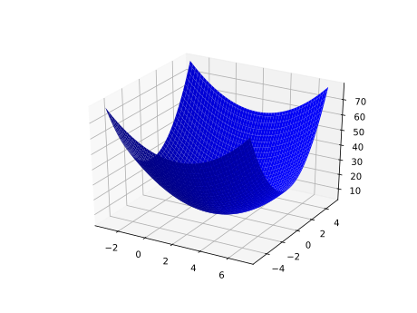

# ML_notebook
<br>
##数据，算法，算力的关系
人工智能有3要素：数据，算法，算力。这三个之间什么关系？我认为并没有主次之分，他们应该有各自的目标，对应不同的问题，而解决三个不同的问题就解决了人工智能。<br>
数据是最基本的。数据的作用是描述问题。如何描述一个问题？将这个问题外在具体化成一个一个的数据。数据对应问题，有一个最小信息量的限制。即，数据携带的信息量有多少，才能完整的描述一个问题？打个比方，想要描述一条直线，那么可以给一大堆点的数据(x,y)。这些点的集合就可以表述一条直线了。不过，但是最少必须给2个点，才能描述一条直线。反过来说，只给两个点，不论使用什么样的算法，用多高的算力，最多也只能算出直线。这里两个点就是直线这一问题的最少数据量。少于这个数据量就不可能成功描述问题。<br>
然后是算法。算法的作用是让计算机（人工智能）理解数据，消化吸收信息的模式，并处理。算法之于数据，同样有一个最小复杂度的问题。我之前学到的算法复杂度，包含了空间复杂度和时间复杂度，其实这里的复杂度还应该包含模型选用不同模型带来的，模型本身的复杂度。之前的例子是：某个问题，一个for循环就没法解决，各种算法都必须遍历两次才行。学了神经网络之后，再将其具体化一些：神经网络有中间层，可以包含很多隐藏层，而每一层又可以包含数量不等的节点。现实中编程可以发现，越是层数多，越是包含节点多，越可以拟合复杂的模型。一个模式，用很多中间层，每层使用很多节点，会将其拟合的很好。然后逐渐降低每层的节点数，或者减少层数量，会发现拟合的结果逐渐变差。当减少到某一界限之后，减少一个节点，或者减少一层，拟合结果突然失真，完全不是之前的精度变差问题，而是结果完全不对了。好像量变引起质变那样。我将其解释为：模型的复杂度无法理解数据所包含的信息，将信息丢失而导致以此为基础的拟合完全不准。这是对算法复杂度的底线的解释：算法复杂度，要与数据匹配，只能多不能少。<br>
最后，算力。算力的作用是将算法运行起来。可以将算法理解成引擎，算力就是汽油。烧掉算力跑算法解决问题。应该说，算力与算法之间没有限制，任何算力都能完成任何算法，只是时间长短有区别。如果硬要说某算法有低限，低于这个底线就跑不动，那可能就是这个算法所要求的加减乘除的次数吧。算法只要能放在电脑上运行，就能分解成底端的寄存器加法器操作，足够时间肯定能做完。或者：算力=TFLOPS*time<br>*
## 数据，算法的一些想法
我认为，数据和算法必须结合在一起才有意义。可以说，我有什么样的数据，数据与其描述的问题，有一个最小下限关系。问题的本质，由特征确定。有多少特征，最少就要有多少数据来描述。但是实际上一个数据往往不能描述一个特征，n个特征需要大于n个数据才能描述<br>
一条直线，有两个特征，位置和斜率。所以要确定一个直线，最少需要2个数据。<br>
一个圆，有2个特征,位置和大小。所以需要
Resource :<br>
https://developers.google.com/machine-learning/crash-course
## [Tensorflow play ground. ](https://playground.tensorflow.org/#activation=tanh&batchSize=10&dataset=gauss&regDataset=reg-plane&learningRate=0.03&regularizationRate=0&noise=0&networkShape=4,2&seed=0.33934&showTestData=false&discretize=false&percTrainData=50&x=true&y=true&xTimesY=false&xSquared=false&ySquared=false&cosX=false&sinX=false&cosY=false&sinY=false&collectStats=false&problem=classification&initZero=false&hideText=false&discretize_hide=false)
## [CNN 解释器](https://poloclub.github.io/cnn-explainer/)
## [神经网络初始化](https://www.deeplearning.ai/ai-notes/initialization/) 及 [中文解释](https://zhuanlan.zhihu.com/p/67149162)
[markdown编辑器](https://pandao.github.io/editor.md/)

**普通正常编程：**
编写规则。数据输入程序之后按规则得到结果。<br>
**机器学习编程：**
给出输入和结果，让机器自己学习规则。得到规则之后，再输入新数据得到结果。
## 机器学习的流程：
构建问题。<br>
找一下已经上标的数据集<br>
为你的模型设计数据<br>
设计你的数据在模型上的input<br>
设计一个容易使用的接口<br>
设计一个有质量的output<br>
澄清问题，设定目标，要解决什么问题-> 想象一下最理想的输出 -> 设定一下判断矩阵：如何判定模型成功，哪个指标来判断-> 你的output是什么？ -> 使用output，你的output可以回答什么问题？ ->这个问题，如果不用ML，使用普通编程，应该如何解决？<br>
解构你的问题-> 从简单情况开始分析->确认数据来源->为你的建模设计数据解构->确保使用比较容易的input->有学习能力-> 考虑一下可能的偏差<br>
|问题|描述|举例|
|--|--|--
|分类|预测属于N类中的哪一类|猫，狗，马，还是熊|
|回归|预测数字|点击率|
|聚类|预测组分类|搜索最相关文档|
|规则学习|寻找关联|如果你买了汉堡，八成也要接着买可乐|
|整体输出|比较复杂的结果输出|自然语言输出， 图片人脸识别|
|排序|预估此结果在整体中的比重|搜索结果排序|

线性模型需要上千个数据训练，神经网络需要十万数量级数据。不要使用机器学习来找有效特征。把所有特征都扔给模型的结果是训练出来的模型超级贵，特别复杂，而且总在一些鸡毛蒜皮的小特征上fit well。设计model要直接解决问题，而不是间接，或者是问题的前置问题。<br>
ML的输出，必须跟着决策！<br>
## ML高难问题
|聚类|异常检测|启发式|
|--|--|--|
|||客人买了书，是不是有可能因为他前几天刚看了这本书的书评？|
## 机器学习概念术语
<b>样本， 特征，标签</b>。样本是要处理的数据，可以写作 <i>X</i>,每个样本都由特征来描述，每个特征可以看作x。每个样本<i>X<sub>i</sub></i>可以看作由j个特征张起的空间中的点<i>X<sub>i</sub></i>（x<sub>i1</sub>,x<sub>i2</sub>,...,x<sub>ij</sub>）。标签可以看成Y。一个样本对应了一个标签，可以看成点X由映射f变换成一个值Y，即f（<i>X<sub>i</sub></i>） = Y。机器学习就是给出空间中大量的点<i>X</i>和映射值Y，来拟合f函数。这个f函数，称之为<b>模型</b>。向模型展示样本，逐渐求出模型的过程，叫<b>训练</b>或<b>学习</b>。给出没有标签的样本<i>X</i>,带入f函数求得对应的Y的过程，称作<b>预测</b>。本质上和解析几何曲线拟合一样。<br>

使用有标签的数据学习，拟合出函数f，称之为有<b>监督的学习</b>。数据无标签，那么就要总结这些数据的模式，称为<b>无监督学习</b><br>

<b>误差</b>预测的数值与实际数值的差值。由于预测数字有时高于实际数字而有时低于，那么使用这个差值的平方，不管误差为证为负统一换算成正值，更容易看出差值。这个平方值也叫<b>方差</b>，或者叫<b>偏差</b>。我们调整模型，使得总体的方差最小而非某一个样本的方差最小。<br>

<b>梯度</b>即与模型参数相关的误差函数的导数。梯度，有两种含义，这在一般教材中没有明确说明，似乎大家都觉得这么简单的事情不必细说。

<b>梯度函数</b>，要确定某个空间曲面f(x,y)的梯度函数梯度,是f(x,y)对所有自变量的偏导数，是一个2维向量，每个分量是一个偏导函数。<b>某一点的梯度</b>是将点(x,y)代入到这个偏导数每个分量得到的向量，这个梯度是一个有着确定值的向量。例如：<br>
f(x,y) = 4+(x-2)<sup>2</sup>+2y<sup>2</sup>,它是一个山谷一样的曲面：<br>
<br>
在(2,0)点有函数最小值4。它的梯度函数是（2x-4,4y）,在（x,y）=(0,0)点的梯度值是（-4，0）。 在阅读资料时碰到梯度，要结合上下文分析说得是梯度函数还是某点的梯度值。<br>

<b>梯度下降法</b>，把误差函数看成上文的f(x,y)，其中x,y是模型的参数。这样将建立函数参数与误差之间的联系。我们的目标是寻找函数的最小值，即最小误差那一点，此时参数是什么值。梯度的方向，是函数上升最快的方向，那么函数的反方向，即使函数下降最快的方向。<br>
比如上例，假设我们不知道函数在（2，0）点可以使得误差变最小，4。我们随机选择一点（0，0），此时误差为f(0,0)=8,(0,0)点的梯度为（-4，0），下降最快的方向是（4，0）。下一次试验的向量应该是（0，0）+n*(4,0)，这里n是<b>步长</b>。如果我们取n=1,那么下个试验向量为（4，0）。代入f中，f(4,0)=8,(4,0)点的梯度为（4，0），下降最快的方向是（-4,0)。那么再下一次的试验向量应该是（4，0）+n(-4,0)。<br>

实际上我们可以看到刚才那一步步长过大使其跨过了极值点，两次梯度的模方向相反，模长相同，暗示我们这一步正好跨到了极值两边相等的两个误差值。如果我们不取n=1,取其一半，则可以到达极值点。刚才那一步，若令n=0.5，则下一个测试向量为（0，0）+0.5* （4，0） = (2,0)。将（2，0）代入f中，误差f(2,0)=4。此时梯度为（0,0），梯度模长=0，说明此点是极值点。即当这个模型的参数(x,y)=(2,0)时，此模型达到最佳模拟，误差为4，是这个模型能做到的最佳性能了。

<b>步长</b>，也称作<b>学习速率</b>。由上例可以看出，若是步长n取得过小，那么机器要迭代很多次才能到达极值。若是n过大，则有可能一步跨过极值。所以一般采取变长步长。当选取的点离极值很远时候采取大步长快速收敛。当选取的点接近极值点时候采取小步长不要跨过极值。这一点可以用当前点的梯度的模长做参考，若是模长接近0，说明梯度越来越小，快要接近极值点了。

上个例子中，**误差函数f实际上是所有样本对于此模型的误差的平均值**。所以改善f（即改变x,y的取值）即可改善对所有样本而言这个模型的预测精度。实际中这样的方法时间太长了。可以使用一个样本训模型。这样的计算量会大大减少，但是结果也不够精确。只用一个样本训练的模型会把所有数据都分类成训练样本同一个预测值。这个叫**单样本训练**。所以要对每个样本都来一次，多次单样本训练。然后记下每个样本对参数的要求，将其加权平均。才得到最后的模型参数。所有参数的加权平均值，可以粗略的看作是误差函数梯度的负数。但是如果每一步，都把所有样本都训练一遍，然后记下参数变化，用新的参数调整模型。再使用所有样本再来一遍，得到下一批参数。这样实在是太费时间。

实际执行中，经常把样本分组，大概10～100数据为一组。使用一组数据调整参数，然后新的模型，代入下一组调整参数。这叫**随机梯度下降**。<br>
要分清楚，这里实际涉及到2个函数:一个可称其为模型。这是为了拟合样本数据的函数，可以将描述样本的特征向量看作自变量，样本的标签看作因变量。我们的最终目的即是求出此函数。但是此模型中的参数未知，为了求解参数，将参数与误差联系起来，建立误差函数(这是另一个函数)。以误差函数对个样本预测的平均误差为参照，调整参数使其最小。这样求出了参数。将这些参数代入模型，就求出了模型<br>
**相关分析 VS. 回归分析**<br>
相关分析不区分自变量与因变量，只讨论变量之间的共同变化的强度和方向，使用的指标是相关系数；而回归分析区分自变量和因变量，自变量也被称为解释变量，因变量被称为结果变量，通过一定的函数关系式来表达它们之间的关系。相关分析是回归分析的基础，回归分析是相关分析的发展。
## Tensorflow
Tensorflow是一个可以构建机器学习的平台。

<br>高层API易于理解，而且方便使用，但是不够灵活，编程时可能会不能满足特定需求。所以编程时应该尽可能从高级API入手，先让程序运转起来。当遇到需要微调时，再下沉一层，调整具体细节。<br>
**tf.estimator API**<br>
tf.estimator API在最顶层。大部分时候都使用这个。tf.estimator所做的一切，都可以用较低级的Tensorflow完成，但是tf.estimator的代码更简介。tf.estimator 与 scikit-learn API（python的一个扩展包）兼容。<br>
**使用Tensorflow做线性回归**<br>
```
import tensorflow as tf

# Set up a linear classifier.
classifier = tf.estimator.LinearClassifier()

# Train the model on some example data.
classifier.train(input_fn=train_input_fn, steps=2000)

# Use it to predict.
predictions = classifier.predict(input_fn=predict_input_fn)
```
[使用conda安装tensorflow](https://docs.anaconda.com/anaconda/user-guide/tasks/tensorflow/)<br>Tensorflow部分弃了谷歌的教程，因为它还在用v1.2的版本，一些命令在目前最新版本2.0已经弃用了。使用[Tensorflow官网的教程](https://www.tensorflow.org/tutorials)来学习。（若是想使用tensorflow 1.x版本，使用tf.compact.v1。）(继续弃用，因为教程太短)<br>
Keras是一个由python编写的开源神经网络库，由于特别好使，所以2017年被Tensorflow收到核心库中。不过独立的Keras仍然存在。似乎tf.keras比独立的keras更新与功能都更快一些。<br>
http://c.biancheng.net/tensorflow/<br>
https://morvanzhou.github.io/tutorials/machine-learning/tensorflow/<br>
http://www.tensorfly.cn/tfdoc/tutorials/overview.html<br>
感觉目前这些教程都不是很好。打算从头写一个简单的神经网络加深理解。
