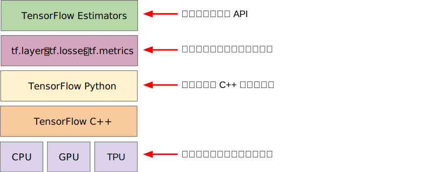

# ML_notebook
<br>
## 数据，算法，算力的关系
人工智能有3要素：数据，算法，算力。这三个之间什么关系？我认为并没有主次之分，他们应该有各自的目标，对应不同的问题，而解决三个不同的问题就解决了人工智能。<br>
数据是最基本的。数据的作用是描述问题。如何描述一个问题？将这个问题外在具体化成一个一个的样本。样本对应问题，有一个最小信息量的限制。即，样本携带的信息量有多少，才能完整的描述一个问题？打个比方，想要描述一条直线，那么可以给一大堆点的数据(x,y)。这些点的集合就可以表述一条直线了。不过，但是最少必须给2个点，才能描述一条直线。反过来说，只给两个点，不论使用什么样的算法，用多高的算力，最多也只能算出直线。这里两个点就是直线这一问题的最少数据量。少于这个数据量就不可能成功描述问题。<br>
然后是算法。算法的作用是让计算机（人工智能）理解数据，消化吸收信息的模式，并处理。算法之于数据，同样有一个最小复杂度的问题。我之前学到的算法复杂度，包含了空间复杂度和时间复杂度，其实这里的复杂度还应该包含模型选用不同模型带来的，模型本身的复杂度。之前的例子是：之前做题，某个问题，一个for循环就没法解决，不论采用什么算法都必须遍历两次才行。学了神经网络之后，再将其具体化一些：神经网络有中间层，可以包含很多隐藏层，而每一层又可以包含数量不等的节点。现实中编程可以发现，越是层数多，越是包含节点多，越可以拟合复杂的模型。一个模式，用很多中间层，每层使用很多节点，会将其拟合的很好。然后逐渐降低每层的节点数，或者减少层数量，会发现拟合的结果逐渐变差。当减少到某一界限之后，减少一个节点，或者减少一层，拟合结果突然失真，完全不是之前的精度变差问题，而是结果完全不对了。好像量变引起质变那样。我将其解释为：模型的复杂度无法理解数据所包含的信息，将信息丢失而导致以此为基础的拟合完全不准。这是对算法复杂度的底线的解释：算法复杂度，要与数据匹配，只能多不能少。<br>
最后，算力。算力的作用是将算法运行起来。可以将算法理解成引擎，算力就是汽油。烧掉算力跑算法解决问题。应该说，算力与算法之间没有限制，任何算力都能完成任何算法，只是时间长短有区别。如果硬要说某算法有低限，低于这个底线就跑不动，那可能就是这个算法所要求的加减乘除的次数吧。算法只要能放在电脑上运行，就能分解成底端的寄存器加法器操作，足够时间肯定能做完。或者：算力=TFLOPS * 时间<br>
## 数据，算法的一些想法
我认为，数据与其描述的问题，有一个最小下限关系。问题的本质，由特征确定。有多少特征，最少就要有多少数据来描述。但是实际上一个数据往往不能描述一个特征，n个特征需要大于n个数据才能描述。数据和算法必须结合在一起才有意义。可以说，我有什么样的数据， 与之配套的是需要什么样的算法，或者我的算法是这样的，需要采集什么样的数据。<br>
一条直线，有两个特征，位置和斜率。如果用点来描述直线，则最少需要2个点，每个点都包含了一部分的位置和斜率信息。<br>
一个圆，有2个特征,位置和大小，所以需要用圆心和半径来确定一个圆。不过半径是长度，如果用点来描述的话，那么需要两个点才能描述一个长度。所以半径（2点）+圆心（1点），起码需要3个点才能确定一个圆。不过我们可以用另一个算法：假设有序点列AB，A表示圆心，B表示圆上任意一点。这样2个点就能确定一个圆。需要数据量变少的原因是：A点保存了圆心信息，又保存了一部分半径信息。<br>
如果用点记录一个三角形，需要几个数据呢？这个还是要和算法结合起来。数据越少，就要求单个数据存储的信息越多，所对应的算法就需要更复杂来解析数据。按照三角形全等的条件：角角边，边边角，三边全等，我起码有3个算法来记录一个三角形.先做一个级别的分解，三种算法中都涉及到边和角，但是边和角不是算法中的数据，算法需要的数据的是点，如何把点转化成边或者角，还需要另一个算法。<br>
如何记录一个边：两点所在的直线可以记录一个边。（可以令两点为边的端点，这样不光记录来点所在的直线，还确定了边的长度。这样每个点包含的信息就更多，但是冗余变少。）如何记录一个角：我认为2个点无论用什么算法都不能记录一个角。角的定义是由一个公共定点发出的射线所夹的角。所以1顶点+2射线（每条线上任取一点）=3个点。所以以上3种用点表示三角形的算法分别需要数据量为:a)角角边：3+3+2 = 8个。b）边边角:2+2+3 = 7个。c) 边边边：2+2+2=6个。当然实际上各算法都可以精简，比如角角边，记录两个角时候会记录角顶点，而两个顶点实际上就记录了一个边。所以可以省略1个边的数据量，只用4个点就可记录一个三角形。同理，边边边需要记录6个点,但是可以只记录顶点，这样使用每个点计算边时，可以每个点使用两次，相当于每个点包含的信息增多了。<br>
Resource :<br>
https://developers.google.com/machine-learning/crash-course
## [Tensorflow play ground. ](https://playground.tensorflow.org/#activation=tanh&batchSize=10&dataset=gauss&regDataset=reg-plane&learningRate=0.03&regularizationRate=0&noise=0&networkShape=4,2&seed=0.33934&showTestData=false&discretize=false&percTrainData=50&x=true&y=true&xTimesY=false&xSquared=false&ySquared=false&cosX=false&sinX=false&cosY=false&sinY=false&collectStats=false&problem=classification&initZero=false&hideText=false&discretize_hide=false)
## [CNN 解释器](https://poloclub.github.io/cnn-explainer/)
## [神经网络初始化](https://www.deeplearning.ai/ai-notes/initialization/) 及 [中文解释](https://zhuanlan.zhihu.com/p/67149162)
## 免费的online GPU资源
https://www.kaggle.com/<br>
https://medium.com/deep-learning-turkey/google-colab-free-gpu-tutorial-e113627b9f5d<br>
[markdown编辑器](https://pandao.github.io/editor.md/)

**普通正常编程：**
编写规则。数据输入程序之后按规则得到结果。<br>
**机器学习编程：**
给出输入和结果，让机器自己学习规则。得到规则之后，再输入新数据得到结果。
## 机器学习的流程：
构建问题。<br>
找一下已经上标的数据集<br>
为你的模型设计数据<br>
设计你的数据在模型上的input<br>
设计一个容易使用的接口<br>
设计一个有质量的output<br>
澄清问题，设定目标，要解决什么问题-> 想象一下最理想的输出 -> 设定一下判断矩阵：如何判定模型成功，哪个指标来判断-> 你的output是什么？ -> 使用output，你的output可以回答什么问题？ ->这个问题，如果不用ML，使用普通编程，应该如何解决？<br>
解构你的问题-> 从简单情况开始分析->确认数据来源->为你的建模设计数据解构->确保使用比较容易的input->有学习能力-> 考虑一下可能的偏差<br>
|问题|描述|举例|
|--|--|--
|分类|预测属于N类中的哪一类|猫，狗，马，还是熊|
|回归|预测数字|点击率|
|聚类|预测组分类|搜索最相关文档|
|规则学习|寻找关联|如果你买了汉堡，八成也要接着买可乐|
|整体输出|比较复杂的结果输出|自然语言输出， 图片人脸识别|
|排序|预估此结果在整体中的比重|搜索结果排序|

线性模型需要上千个数据训练，神经网络需要十万数量级数据。不要使用机器学习来找有效特征。把所有特征都扔给模型的结果是训练出来的模型超级贵，特别复杂，而且总在一些鸡毛蒜皮的小特征上fit well。设计model要直接解决问题，而不是间接，或者是问题的前置问题。<br>
ML的输出，必须跟着决策！<br>
## ML高难问题
|聚类|异常检测|启发式|
|--|--|--|
|||客人买了书，是不是有可能因为他前几天刚看了这本书的书评？|
## 机器学习概念术语
<b>样本， 特征，标签</b>。样本是要处理的数据，可以写作 <i>X</i>,每个样本都由特征来描述，每个特征可以看作x。每个样本<i>X<sub>i</sub></i>可以看作由j个特征张起的空间中的点<i>X<sub>i</sub></i>（x<sub>i1</sub>,x<sub>i2</sub>,...,x<sub>ij</sub>）。标签可以看成Y。一个样本对应了一个标签，可以看成点X由映射f变换成一个值Y，即f（<i>X<sub>i</sub></i>） = Y。机器学习就是给出空间中大量的点<i>X</i>和映射值Y，来拟合f函数。这个f函数，称之为<b>模型</b>。向模型展示样本，逐渐求出模型的过程，叫<b>训练</b>或<b>学习</b>。给出没有标签的样本<i>X</i>,带入f函数求得对应的Y的过程，称作<b>预测</b>。本质上和解析几何曲线拟合一样。<br>

使用有标签的数据学习，拟合出函数f，称之为有<b>监督的学习</b>。数据无标签，那么就要总结这些数据的模式，称为<b>无监督学习</b><br>

<b>误差</b>预测的数值与实际数值的差值。由于预测数字有时高于实际数字而有时低于，那么使用这个差值的平方，不管误差为证为负统一换算成正值，更容易看出差值。这个平方值也叫<b>方差</b>，或者叫<b>偏差</b>。我们调整模型，使得总体的方差最小而非某一个样本的方差最小。<br>

<b>梯度</b>即与模型参数相关的误差函数的导数。梯度，有两种含义，这在一般教材中没有明确说明，似乎大家都觉得这么简单的事情不必细说。

<b>梯度函数</b>，要确定某个空间曲面f(x,y)的梯度函数梯度,是f(x,y)对所有自变量的偏导数，是一个2维向量，每个分量是一个偏导函数。<b>某一点的梯度</b>是将点(x,y)代入到这个偏导数每个分量得到的向量，这个梯度是一个有着确定值的向量。例如：<br>
f(x,y) = 4+(x-2)<sup>2</sup>+2y<sup>2</sup>,它是一个山谷一样的曲面：<br>
<br>
在(2,0)点有函数最小值4。它的梯度函数是（2x-4,4y）,在（x,y）=(0,0)点的梯度值是（-4，0）。 在阅读资料时碰到梯度，要结合上下文分析说得是梯度函数还是某点的梯度值。<br>

<b>梯度下降法</b>，把误差函数看成上文的f(x,y)，其中x,y是模型的参数。这样将建立函数参数与误差之间的联系。我们的目标是寻找函数的最小值，即最小误差那一点，此时参数是什么值。梯度的方向，是函数上升最快的方向，那么函数的反方向，即使函数下降最快的方向。<br>
比如上例，假设我们不知道函数在（2，0）点可以使得误差变最小，4。我们随机选择一点（0，0），此时误差为f(0,0)=8,(0,0)点的梯度为（-4，0），下降最快的方向是（4，0）。下一次试验的向量应该是（0，0）+n*(4,0)，这里n是<b>步长</b>。如果我们取n=1,那么下个试验向量为（4，0）。代入f中，f(4,0)=8,(4,0)点的梯度为（4，0），下降最快的方向是（-4,0)。那么再下一次的试验向量应该是（4，0）+n(-4,0)。<br>

实际上我们可以看到刚才那一步步长过大使其跨过了极值点，两次梯度的模方向相反，模长相同，暗示我们这一步正好跨到了极值两边相等的两个误差值。如果我们不取n=1,取其一半，则可以到达极值点。刚才那一步，若令n=0.5，则下一个测试向量为（0，0）+0.5* （4，0） = (2,0)。将（2，0）代入f中，误差f(2,0)=4。此时梯度为（0,0），梯度模长=0，说明此点是极值点。即当这个模型的参数(x,y)=(2,0)时，此模型达到最佳模拟，误差为4，是这个模型能做到的最佳性能了。

<b>步长</b>，也称作<b>学习速率</b>。由上例可以看出，若是步长n取得过小，那么机器要迭代很多次才能到达极值。若是n过大，则有可能一步跨过极值。所以一般采取变长步长。当选取的点离极值很远时候采取大步长快速收敛。当选取的点接近极值点时候采取小步长不要跨过极值。这一点可以用当前点的梯度的模长做参考，若是模长接近0，说明梯度越来越小，快要接近极值点了。

上个例子中，**误差函数f实际上是所有样本对于此模型的误差的平均值**。所以改善f（即改变x,y的取值）即可改善对所有样本而言这个模型的预测精度。实际中这样的方法时间太长了。可以使用一个样本训模型。这样的计算量会大大减少，但是结果也不够精确。只用一个样本训练的模型会把所有数据都分类成训练样本同一个预测值。这个叫**单样本训练**。所以要对每个样本都来一次，多次单样本训练。然后记下每个样本对参数的要求，将其加权平均。才得到最后的模型参数。所有参数的加权平均值，可以粗略的看作是误差函数梯度的负数。但是如果每一步，都把所有样本都训练一遍，然后记下参数变化，用新的参数调整模型。再使用所有样本再来一遍，得到下一批参数。这样实在是太费时间。

实际执行中，经常把样本分组，大概10～100数据为一组。使用一组数据调整参数，然后新的模型，代入下一组调整参数。这叫**随机梯度下降**。<br>
要分清楚，这里实际涉及到2个函数:一个可称其为模型。这是为了拟合样本数据的函数，可以将描述样本的特征向量看作自变量，样本的标签看作因变量。我们的最终目的即是求出此函数。但是此模型中的参数未知，为了求解参数，将参数与误差联系起来，建立误差函数(这是另一个函数)。以误差函数对个样本预测的平均误差为参照，调整参数使其最小。这样求出了参数。将这些参数代入模型，就求出了模型<br>
**相关分析 VS. 回归分析**<br>
相关分析不区分自变量与因变量，只讨论变量之间的共同变化的强度和方向，使用的指标是相关系数；而回归分析区分自变量和因变量，自变量也被称为解释变量，因变量被称为结果变量，通过一定的函数关系式来表达它们之间的关系。相关分析是回归分析的基础，回归分析是相关分析的发展。
## Tensorflow
### [tensorflow v2.2.0的官方文档](https://tensorflow.google.cn/api_docs)
### [tensorflow民间文档](https://www.w3cschool.cn/tensorflow_python/)
Tensorflow是一个可以构建机器学习的平台。

<br>高层API易于理解，而且方便使用，但是不够灵活，编程时可能会不能满足特定需求。所以编程时应该尽可能从高级API入手，先让程序运转起来。当遇到需要微调时，再下沉一层，调整具体细节。<br>
**tf.estimator API**<br>
tf.estimator API在最顶层。大部分时候都使用这个。tf.estimator所做的一切，都可以用较低级的Tensorflow完成，但是tf.estimator的代码更简介。tf.estimator 与 scikit-learn API（python的一个扩展包）兼容。<br>
**使用Tensorflow做线性回归**<br>
```
import tensorflow as tf

# Set up a linear classifier.
classifier = tf.estimator.LinearClassifier()

# Train the model on some example data.
classifier.train(input_fn=train_input_fn, steps=2000)

# Use it to predict.
predictions = classifier.predict(input_fn=predict_input_fn)
```
[使用conda安装tensorflow](https://docs.anaconda.com/anaconda/user-guide/tasks/tensorflow/)<br>Tensorflow部分弃了谷歌的教程，因为它还在用v1.2的版本，一些命令在目前最新版本2.0已经弃用了。使用[Tensorflow官网的教程](https://www.tensorflow.org/tutorials)来学习。（若是想使用tensorflow 1.x版本，使用tf.compact.v1。）(继续弃用，因为教程太短)<br>
Keras是一个由python编写的开源神经网络库，由于特别好使，所以2017年被Tensorflow收到核心库中。不过独立的Keras仍然存在。似乎tf.keras比独立的keras更新与功能都更快一些。感觉，tf.keras是tensorflow最上一层api，最简单易用。tf最新也推荐转移到tf.keras。tensorflow与keras的关系[这里](https://www.jiqizhixin.com/articles/2019-12-09-10)。<br>
https://morvanzhou.github.io/tutorials/machine-learning/tensorflow/<br>
https://zhuanlan.zhihu.com/p/59507137<br>
https://zhuanlan.zhihu.com/p/79406360<br>
感觉目前这些教程都不是很好。打算从头写一个简单的神经网络加深理解。具体过程[这里](./firstcnn.md)<br>
我对[使用组合特征进行机器学习](https://developers.google.com/machine-learning/crash-course/feature-crosses/encoding-nonlinearity)可以取得更好训练结果的总结经验： x1，x2分别表示了数据水平方向和竖直方向的特征，使用了x3=x1 * x2的时候，相当于引入了新的信息，**水平方向和竖直方向之间的关系**， 因为模型得到了新的信息，所以训练效果更好。使用组合特征，可以反应特征之间的联系。或许联系才是问题的关键特征。能反应问题的特征值，将对训练模型特别有帮助，而不能很好反应问题的特征值，即使考虑进模型中，训练出来的模型，权值也很低，和不考虑他一个效果。<br>

我好像搞错了一件事情，之前我认为模型的复杂度应该越高越好，因为低复杂度的模型不足以解决数据问题，而高复杂度带来的缺点只有计算量过大而已。不过似乎真实不是这样。高复杂度的模型有时候还过拟合，预测效果不好。这样看来，整个神经网络的过程都要很谨慎：1）选数据要谨慎，要除去噪音，要选能代表问题的数据，奇异点什么的都要洗去，不要选不具有代表性的数据。2）选择训练特征要谨慎，有时候要选x，y，有时候要选xy，有时候要选x<sup>2</sup>和y<sup>2</sup>,选择单一特征，还是组合特征也有学问。3）选择模型要谨慎，不正确的模型无论什么数据上去，结果都很差。4）模型复杂度要谨慎，复杂度低了，不能解析问题。复杂度高了，过拟合。<br>

然后，就被介绍了一个L2正则化来平衡复杂度过度的情况。简单来说，设定一个代价函数，与损失函数一并考虑。每增加一个参数，就要增加一定的代价。增加参数个数会增加代价，但是也会降低损失。将参数的代价和损失一并考虑，可以平衡出一个既可以接受的误差损失，又不是很复杂的参数模型（防止过拟合）.<br>
### 找到了很好的[tensorflow基础教程](https://github.com/dragen1860/Deep-Learning-with-TensorFlow-book)
### [tensorflow v2.2.0的官方文档](https://tensorflow.google.cn/api_docs)
### [tensorflow民间文档](https://www.w3cschool.cn/tensorflow_python/)
#### 基本数据类型和基本概念
数据分为数值，字符串，布尔。基本概念：标量(Scalar)，向量(Vector)，矩阵(Matrix)，tf成员属性.shape特征，张量（Tensor）。一般把标量，向量，矩阵也看成张量，只是这几个的纬度（shape）都很小罢了。张量是tensorflow的主要数据类型。各种张量的赋值如下：
```
a0 = 1.2 # python语言方式创建标量
a1 = tf.constant(1.2) # TF方式创建标量 
print(type(a), type(a1), tf.is_tensor(a1))
a2 = tf.constant([1,2.,3.3]) # TF的向量
x = a2.numpy()  # 将一个TF向量/张量变为numpy.array格式，方便向其他函数传递
a3 = tf.constant([1.2]) # 这是一个1*1的向量，用.shape和type（）查看一下和a1的区别
a4 = tf.constant([[1,2],[3,4]])  # 2*2 矩阵
a5 = tf.constant([[[1,2],[3,4]],[[5,6],[7,8]]]) # 创建3维张量
```
a6 = tf.constant('Hello, Deep Learning.') 将创建tf的字符串，可以使用tf.strings中的函数处理，比如lower()， join(),split(),length()等等。<br>
a7 = tf.constant([True, False]) # 创建布尔类型向量。要注意，TF的布尔型变量与python自带的布尔型不能比较。可以把a7转变成numpy()，再比较。<br>
#### TF的数据精度
有tf.int16、tf.int32、tf.int64、tf.float16、tf.float32、 tf.float64， tf.float64即tf.double。在保存张量时，指定dtype成员属性即可强制保存成想要的精度。例如：<br>
a4 = tf.constant([[1,2],[3,4]], dtype =tf.int32) <br>
同理也可用a4.dtype查看张量的精度。一般情况下tf.int32 和 tf.float32 可满足大部分需要。<br>
使用cast()可以转换精度。注意不要溢出。也可用于布尔型和整形的转换<br>
#### 待优化张量
为了区分需要计算梯度信息的张量与不需要计算梯度信息的张量，TensorFlow 增加了 一种专门的数据类型来支持梯度信息的记录:tf.Variable。tf.Variable 类型在普通的张量类型基础上添加了 name，trainable 等属性来支持计算图的构建。由于梯度运算会消耗大量的 计算资源，而且会自动更新相关参数，对于不需要的优化的张量，如神经网络的输入𝑿， 不需要通过 tf.Variable 封装;相反，对于需要计算梯度并优化的张量，如神经网络层的𝑾 和𝒃，需要通过 tf.Variable 包裹以便 TensorFlow 跟踪相关梯度信息。
```
a = tf.constant([-1, 0, 1, 2]) # 创建 TF 张量 
aa = tf.Variable(a) # 转换为 Variable 类型 
aa.name, aa.trainable # Variable类型张量的属性
```
也可直接用Variable()函数直接创建优化张量：
```
a = tf.constant([-1, 0, 1, 2]) # 创建 TF 张量 
aa = tf.Variable(a) # 转换为 Variable 类型 
aa.name, aa.trainable # Variable类型张量的属性
```
待优化张量可视为普通张量的特殊类型，普通张量其实也可以通过 GradientTape.watch()方 法临时加入跟踪梯度信息的列表，**从而支持自动求导功能。**<br>
我觉得，TF支持的自动求导功能，才有了那么一点“电脑是人类智慧的延伸”的感觉。锤子，扳手是手的延伸。而自动求导能替代脑力的繁琐思考，这才是智力延伸的体现。for循环之类的虽然也是节约了脑力，还是太低级了。<br>
#### 创建张量
记得函数 tf.convert_to_tensor(), tf.constant(), tf.zeros([]), tf.ones([]), tf.zeros_like(), tf.ones_like(), tf.fill(shape, value), tf.random.normal(shape, mean=0.0, stddev=1.0),  tf.random.uniform(shape, minval=0, maxval=None, dtype=tf.float32), 这些可以创建张量，全零/全1张量，正太分布张量，平均分布张量等，具体看[这本书](https://github.com/dragen1860/Deep-Learning-with-TensorFlow-book)的第四章<br>
循环时用的range函数，用tf.range()来替代,创建序列。<br>
**张量的典型应用**<br>
标量,shape=[]。标量的一些典型用途是误差值的表示、各种测量指标的表示，比如准确度(Accuracy， 简称 acc)，精度(Precision)和召回率(Recall)等。<br>
向量， shape = [n]。 向量一般用来表示偏置量***b***.<br> 
矩阵， shape = [m,n]。 如果一个节点的权值w<sub>i</sub>,可以用向量***w<sub>i</sub>***,那么这一层所有n个节点的权值就可以看成矩阵***W***.
```
x = tf.random.normal([2,4])
w = tf.ones([4,3])
b = tf.zeros([3])
o = x@w+b  # X@W+b运算
```
激活函数为空。一般地，𝜎(𝑿@𝑾 + 𝒃)网络层称为全连接层，在 TensorFlow 中可以通过 Dense 类直接实现，特 别地，当激活函数𝜎为空时，全连接层也称为线性层.
```
fc = layers.Dense(3) # 定义全连接层的输出节点为3
fc.build(input_shape=(2,4)) # 定义全连接层的输入节点为 4 
fc.kernel # 查看权值矩阵W
```
三维张量：shape有2个以上的值。典型应用是表示序列信号: 𝑿 = [𝑏, sequence len, feature len] .𝑏表示序列信号的数量，sequence len 表示序列信号在时间维度上的采样点数或步数，
feature len 表示每个点的特征长度。<br>
四维张量, 在卷积神经网络中应用非常广泛，它用于保存特征图(Feature maps)数据，格式一般定义为*[𝑏, h, w, 𝑐]。 其中𝑏表示输入样本的数量，h/ 分别表示特征图的高/宽，𝑐表示特征图的通道数，部分深度学习框架也会使用[𝑏, 𝑐, h, c]格式的特征图张量，例如PyTorch。
#### 索引与切片
通过索引与切片操作可以提取张量的部分数据，它们的使用频率非常高。<br>

```
# 索引
x = tf.random.normal([4,32,32,3]) # 创建4D张量。表示4个样本，每个样本是32*32的图片，每个像素点有红黄蓝3个颜色。

In [51]:x[0] # 程序中的第一的索引号应为0，容易混淆，不过不影响理解
Out[51]:<tf.Tensor: id=379, shape=(32, 32, 3), dtype=float32, numpy= array([[[ 1.3005302 , 1.5301839 , -0.32005513],
[-1.3020388 , 1.7837263 , -1.0747638 ], ...
[-1.1092019 , -1.045254 , -0.4980363 ],
[-0.9099222 , 0.3947732 , -0.10433522]]], dtype=float32)>

In [52]:x[0][1]  # 选取第1张图片，第2行
Out[52]:
<tf.Tensor: id=388, shape=(32, 3), dtype=float32, numpy= array([[ 4.2904025e-01, 1.0574218e+00, 3.1540772e-01],
[ 1.5800388e+00, -8.1637271e-02, 6.3147342e-01], ...,
[ 2.8893018e-01, 5.8003378e-01, -1.1444757e+00],
[ 9.6100050e-01, -1.0985689e+00, 1.0827581e+00]], dtype=float32)>

In [53]: x[0][1][2] # 选取第1张图片，第2行，第3列
Out[53]:
<tf.Tensor: id=401, shape=(3,), dtype=float32, numpy=array([-0.55954427, 0.14497331, 0.46424514], dtype=float32)>

In [54]:x[2][1][0][1]  # 选取第1张图片，第2行，第3列,第2颜色通道。
Out[54]:
<tf.Tensor: id=418, shape=(), dtype=float32, numpy=-0.84922135>

In [55]: x[1,9,2]  # 写[𝑖][𝑗]. . . [𝑘]的方式书写不方便，可以直接写[𝑖, 𝑗, ... , 𝑘]
Out[55]:
<tf.Tensor: id=436, shape=(3,), dtype=float32, numpy=array([ 1.7487534 , - 0.41491988, -0.2944692 ], dtype=float32)>
```
切片： 通过start: end: step切片方式可以方便地提取一段数据，其中 start 为开始读取位置的索引，end 为结束读取位置的索引(不包含 end 位)，step 为采样步长。
```
In [56]: x[1:3] # 读取2，3张图片
Out[56]:
<tf.Tensor: id=441, shape=(2, 32, 32, 3), dtype=float32, numpy=
array([[[[ 0.6920027 , 0.18658352, 0.0568333 ], [ 0.31422952, 0.75933754, 0.26853144],
[ 2.7898 , -0.4284912 , -0.26247284],...
```
<br>

(学了4章才看清楚，一共有15章，太多了啊，才看到第四章。慢慢学。)<br>
**改变视图** 其实tf数据是按照1维来存储到机器里的，shape有这么多变化，完全是因为人们看待数据的角度不同。比如：`x = tf.range(96)`，生成从0到95的1维向量。那么`x=tf.reshape(x,[2,4,4,3])`，可以看到：shape=(2, 4, 4, 3)。可以这样认为：2张图像，每张是4行4列像素，每个像素有红黄蓝3原色。但是[𝑏, h, w, 𝑐]4维张量，可以有不同的解释方法：<br>
[𝑏, h, w, 𝑐] 张量理解为𝑏张图片，h * w个像素点，𝑐个通道<br>
[𝑏, h, w, 𝑐] 张量理解为𝑏张图片，h行，每行的特征长度为 w * 𝑐 <br>
[𝑏, h, w, 𝑐] 张量理解为𝑏张图片，每张图片的特征长度为h * w * c <br>
根据不同的理解方法，会有不同的shape解读。但是解读不同，不影响最终在内存中存储，都是一样的。不过如果本应为[𝑏, h, w, 𝑐]的格式，出现了[𝑏,w, h, 𝑐], 或者[𝑏, 𝑐, h ∗w]这样不合法的数据时候，就要用**视图变换**，将不同的纬度换到正确的位置，否则变换出来的图片就会混乱。可以用reshape（）函数就可以改变bhwc等。<br>
通过 `tf.expand_dims(x, axis)` 可以在x张量，第axis分量前插入一个新纬度。逆操作可以删除纬度： `tf.squeeze(x, axis)`。可以在把x的第axis纬度删除。如果不指定axis的话，即`tf.squeeze(x）`，那就伤处x中所有纬度为1的纬度。比如纬度[1，28，28，1]表示了1张图片，28 * 28，色彩度只有1。用了`tf.squeeze(x）`之后，x.shape = (28,28) **注意**：插入/删除纬度并没有改变x的数值，原来有多少还有多少，只是这些数的分组变化了。<br>
交换纬度： 将[𝑏, h,w, 𝑐]交换为[𝑏,w, h, 𝑐]。使用函数:`tf.transpose(x, perm)`
```
x = tf.random.normal([2,32,32,3])
tf.transpose(x,perm=[0,3,1,2]) # 交换维度
```
复制维度： `tf.tile(x, multiples)`<br>
Broadcasting：广播机制。可以复制一整个张量。实际上是先占住茅坑，等需要时候再拉屎。实际运行broadcasting可以因为运算约分等免去大部分的数据真实复制，只有不能简化，需要最后运算时候，再复制真实数据。这样就减少了运算代价。`tf.broadcast_to(x, new_shape)`可以将x拓展为新的shape，比如：
```
A = tf.random.normal([32,1]) # 创建矩阵
tf.broadcast_to(A, [2,32,32,3]) # 扩展为4D张量
```
广播机制很有趣，去本书的第4章好好读一下。<br>
接下来是加减乘除。TF的+-* /已经被重载过了，// %也重载过了。可以直接加减乘除，整除，求余。tf.pow(x,3)， tf.power(x,n)可以实现x的n次方。 x** 2 乘方。x ** (0.5) 开平方。 tf.square(x)和 tf.sqrt(x)，平方和平方根。 tf.pow(a, x)或者** 指数运算a<sup>x</sup>。 tf.exp(x), 自然指数e<sup>x</sup>。tf.math.log(x) 自然对数log<sub>e</sub>x。如果计算其他底数的指数，可以用换底公式。目前TF没有任意底的函数。<br>
**矩阵相乘运算** tf.matmul(a, b)或者@可以进行矩阵相乘。TensorFlow 中的 矩阵相乘可以使用批量方式，也就是张量𝑨和𝑩的维度数可以大于 2。当张量𝑨和𝑩维度数大 于 2 时，TensorFlow 会选择𝑨和𝑩的最后两个维度进行矩阵相乘，前面所有的维度都视作 Batch 维度。根据矩阵相乘的定义，𝑨和𝑩能够矩阵相乘的条件是，𝑨的倒数第一个维度长度(列)和𝑩 的倒数第二个维度长度(行)必须相等。比如张量 a shape:[4,3,28,32]可以与张量 b shape:[4,3,32,2]进行矩阵相乘。
```
a = tf.random.normal([4,3,28,32]) 
b = tf.random.normal([4,3,32,2])
a@b # 批量形式的矩阵相乘
```
**总结一下第四章学到的TF基本语法：**<br>
TF的数据中,dtype表示数据精度，shape表示数据纬度。通过.dtype和.shape访问。也可以在初始化时候指定dtype<br>
**数据类型:** 数值（int 16/32/64, float 16/32/64）, 字符串， 布尔
| 概念 | 特征  | 命令 | 例子 | 说明 |
|  ----  | ----  | ----  | ----  | ---- |
| 标量（scalar）  | shape =[] | tf.constant(1.2) | 1.2| | 
| 向量（vector）  | shape =[n] | tf.constant([1,2.,3.3])|[10, 2.0, 3.3]| |
| 矩阵（matrix）  | shape =[m,n] | tf.constant([[1,2],[3,4]])|[[1,2],[3,4]]| |
| 张量（tensor）  | shape =[m,n,o,....] | tf.constant([[[1,2],[3,4]],[[5,6],[7,8]]])|[[[1,2],[3,4]],[[5,6],[7,8]]]|标量，向量，矩阵都可以看成张量 |
| 布尔型（bool）  |将上述张量赋值为布尔变量，只有True或False| tf.constant(True) | True| | 

**TF的命令** 
| 概念 | 命令 | 例子 | 说明 |
|  ----  | ----  | ----  | ---- |
| 判断是否是TF张量 |tf.is_tensor（a） | |返回普通的True， False， 而不是TF的布尔型 |
| 精度转换 | tf.cast(a, tf.double) || 将原本dtype= float32的a张量转化为float64， **注意**，布尔型也可以转变成整形|
| 纬度转换 | tf.reshape(x, new_shape) |tf.reshape (x,[2,-1]) |参数−1表示当前轴上长度需要根据张量总元素不变的法则自动推导,总数据除以各个分量，最后剩下的就是 |
| 增加维度 | tf.expand_dims(x, axis) | | 在指定的 axis 轴前可以插入一个新的维度, 如果axis比最高纬度（从0开始计算）还高1，那么就插在最末尾|
| 删除维度 | tf.squeeze(x, axis)| | axis为纬度索引号 |
| 交换维度 | tf.transpose(x, perm)| tf.transpose(x,perm =[0,3,1,2])| x原先的[0,1,2,3]变成了[0,3,1,2]|
| 复制维度 | tf.tile(x, multiples) | | multiples 分别指 定了每个维度上面的复制倍数，对应位置为 1 表明不复制，为 2 表明新长度为原来长度的 2 倍，即数据复制一份，以此类推。若原来shape=[m,n], multiples = [a,b], 则复制后的shape= [am, bn]|
| 待优化张量| tf.Variable(a)| | 一般，神经网络中间层𝑾 和𝒃需要优化，而输入输入𝑿则不需要优化。有name和trainable属性，是待优化张量特有的|
| 转化成为张量 |tf.convert_to_tensor(a) | | a是数组或者普通数组，或者是Numpy Array对象。 tf.constant(a)也有同样的作用|
| 生成全0/1张量| tf.zeros([])，tf.ones([])|tf.zeros(2,2)|会生成[[0,0],[0,0]]矩阵|
| 转化成0/1张量| tf.zeros_like（）， tf.ones_like| tf.zeros_like（a） | 创建了和a一样纬度的全零张量 |
| 自定义数值张量| tf.fill(shape, value)| tf.fill([2,2], 99)| 创建2行2列，元素全为99的矩阵| 
| 创建正太分布张量| tf.random.normal(shape, mean=0.0, stddev=1.0) | | 可自定义shape， mean和stddev | 
| 创建平均分布张量| tf.random.uniform(shape, minval=0, maxval=None, dtype=tf.float32) | | minval， maxval默认值为 \[0 ,1)|
| 创建序列| tf.range(start, limit, delta=1) | | 默认start=0, delta = 1,从0到5的序列可以简写为tf.|
| 广播（Broadcasting）| tf.broadcast_to(x, new_shape)| |广播机制有如下特点： 1.融合了插入纬度和复制纬度。并且是自动进行不需干预。 2. 复制纬度暂时先不复写数据，经过优化有的地方只需形式运算，待到必须计算数据时候再复写数据，节约了运算量。|
| 加减乘除|+、 − 、 ∗ 、/ | | 已经全部重载过了| 
| 整除，求余| //、%| | |
| 乘方，开方| tf.pow(x, a)| | ** 重载过了。开方的话，tf.pow(x, 0.5)或x ** 0.5就可以开平方|
| 平方，平方根 | tf.square(x)， tf.sqrt(x)| | |
| 指数 |tf.pow(a, x) | 2 ** x|  |
| 自然指数 | tf.exp(x)| | | 
| 自然对数 | tf.math.log(x)  | | |
| 任意底对数 | | |TF尚不支持除自然对数之外的对数。可以用换底公式 |
| 矩阵相乘| @| | 支持Broadcasting机制。矩阵相乘是2维矩阵的相乘。A@B要保证A的最后一维要和B的第一维相通。shape = [4,28,32]与[32,16]相乘， 其实是28 * 32的矩阵与32 * 16的矩阵相乘，得到28 * 16的矩阵。所以最后的张量 shape = [4,28,16]|
| 求平均数 |tf.reduce_mean( input_tensor, axis=None, keep_dims=False, name=None, reduction_indices = None)| tf.reduce_mean(loss)| 用来降维，或者是来求tensor某一维度的均值|

下面开始[第二个CNN](./second_cnn.md)，用TF来试试吧。第二CNN结束，第四章结束。<br>
**第五章，TensorFlow 进阶**<br>
| 概念 | 用途 | 命令 | 例子 |  说明|
| --- | --- | --- | --- | --- |
| 拼接 | 将两个部分的数据，拼接为一个整体数据。 | tf.concat(tensors, axis)| tf.concat([a,b],axis=0)|axis表示拼接的轴。非拼接轴必须保证维度一致。拼接不增加维度。shape = [4,35,2]与[6,35,2]在第0轴拼接的结果是 shape = [10,35,2]|
| 堆叠 | 将数据罗列成数据集 |  tf.stack(tensors, axis) | tf.stack([a,b],axis=0)| 增加新的维度，表示数据集中有多少个数据。数据集的shape必须完全相同。shape=[35,8] 与shape=[35,8]的拼接结果是[2,35,8]|
| 分割 | 将一个张量拆分成多个分量 | tf.split(x, num_or_size_splits, axis)| | 拼接的逆操作。 num_or_size_splits=n 时，则均分为n份，若是list列表，则按照列表中的分。|
| 切碎 | 将数据集拆散为单个数据 |tf.unstack(x, axis) | tf.unstack(x,axis=0) | 堆叠的逆操作。将张量按axis轴全部切成0维。切碎之后该维度消失。|
| 向量范数(Vector Norm）| 查看表征向量“长度” |  tf.norm(x, ord)| | ord = 0,1,np.inf 分别代表查看L1,L2,无穷范数|
| 最值、均值、和| | tf.reduce_max(x, axis) tf.reduce_mintf.reduce_max(x, axis) tf.reduce_meantf.reduce_max(x, axis) tf.reduce_sumtf.reduce_max(x, axis)| | axis表示查看对应轴 |
| 极值索引 | 查找最大值/最小值的序列号 | tf.argmax(x, axis) tf.argmin(x, axis)| | 查找在axis轴上的序列。经常用于查看最高概率属于那个类|
| 比较 | 比较2个张量 | tf.equal(a, b) | tf.equal(pred,y) |  |
| 填充 | 将张量的左右填充无意义的数据，使得数据长度适合算法 | tf.pad(x, paddings) |tf.pad(b, [[0,2]])|paddings是[Left Padding, Right Padding]的list。例子表示在b的左边填充0个右边填充2个。 |
| 复制 | 复制长度为1的维度| tf.tile(x, multiples)| | 之前介绍过 |
| 数据限幅| 截断数据上下限 |  tf.maximum(x, a) tf.minimum(x, a)| | |

高级函数
| 概念 | 用途 | 命令 | 例子 | 说明 |
| --- | --- | --- | --- | --- |
| 收集| 指定维度上按序号抽取数据 | tf.gather(x,[],axis)| | 收集张量x在axis纬度上，list内所对应的序列，然后合并成一个张量|
| | | | | |

