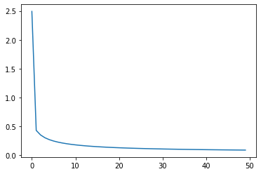

## 这是我写的第二个CNN，虽然目前尚未完成，但是比第一个，有一些不一样: 
1.使用用更多的数据。第一个cnn使用了100个数据训练。这次要使用MINST数据集，数字手写数据集<br>
2.首次使用tensorflow。tensorflow正在学，但是我没学完就想用。神经网络反向推导时候，要对每个参数求偏导数，当网络层数增加、数据特征长度增大以及添加复杂的非线性函数之后，模型的表达式将变得 非常复杂，很难手动推导出模型和梯度的计算公式。而且一旦网络结构发生变动，网络的 模型函数也随之发生改变，依赖手动计算梯度的方式显然不可行。深度学习框架有自动求导技术，设定好参数，就可以自动求导。<br>
3.首次使用谷歌的在线GPU运算(Google Colab)，估计GPU运算速度能提高不少。<br>
4.使用ReLU函数，上次使用的是sigmoid.<br>
本次的模型神经网络，有三层。输入节点784个，第一层256，第二次128， 第三城10.结构如下：<br>
    out = 𝑅𝑒𝐿𝑈{𝑅𝑒𝐿𝑈{𝑅𝑒𝐿𝑈[𝑿@𝑾1 + 𝒃1]@𝑾2 + 𝒃2}@𝑾 + 𝒃 }  <br>
```
# 载入包，导入数据
import tensorflow as tf
from tensorflow import keras
from tensorflow.keras import layers, optimizers, datasets
(x, y), (x_val, y_val) = datasets.mnist.load_data()  
# （x,y）是训练数据，x是特征，y是标签。同样 (x_val, y_val)是检测数据。
```
构造中间层
```
# 每层的张量都需要被优化，故使用Variable类型，并使用截断的正太分布初始化权值张量
# 初始的b都赋值成0
w1 = tf.Variable(tf.random.truncated_normal([784, 256], stddev=0.1)) 
b1 = tf.Variable(tf.zeros([256]))
w2 = tf.Variable(tf.random.truncated_normal([256, 128], stddev=0.1)) 
b2 = tf.Variable(tf.zeros([128]))
w3 = tf.Variable(tf.random.truncated_normal([128, 10], stddev=0.1)) 
b3 = tf.Variable(tf.zeros([10]))
```
第一层的w1是784行，256列，查看目前的x.shape可知，shape=[60000,28,28]<br> 
**注意这里有几个坑：** 1.x是不能和w1矩阵相乘的。维度对不上。使用`tf.reshape(x, [-1, 28*28])`，将其转化为60000 * 784, 也就是把行列相乘，看作60000个混合特征的样本。这样维度就对上了。 2.转换之后仍然不可相乘。会出现:NotFoundError: Could not find valid device for node. 原因是x.dtype = tf.uint8。使用`tf.cast(x, tf.float32)`将其转换。 3. 转换之后仍然不能使用。因为x取值范围是0~255,w1矩阵都是标准正太分布取的值，两者相差太大。 要将x取值变换到[-1，1]之间。<br>
```
x1 = tf.reshape(x, [-1, 28*28]) # x原先是numpy.ndarray类型，但是也有shape，x.shape = [60000,28,28] 60000个28*28的图片
x1 = tf.cast(x1, tf.float32)  # 然后将x直接变成tensor,然后还reshape了一下，之后x变为shape = [60000, 784],可以和w1矩阵相乘。
x1 = 2*x1/255-1      #　将int转化为float32， 然后缩放至-1～1
x2 = 2*tf.convert_to_tensor(x, dtype=tf.float32)/255.-1  # 方法之二，先缩放，再reshape
x2 = tf.reshape(x2, [-1, 28*28])

all(x1[0] == x2[0])  # 可以看到，两种方法得到了一样的数据

y = tf.convert_to_tensor(y, dtype=tf.int32) # 转换为整形张量
y = tf.one_hot(y, depth=10) # one-hot编码

```
那么，开始向前推导，由x->w1,b1-> w2,b2-> w3,b3 -> out.out是个10维向量，与y相比可以得到误差。
```
# 第一层计算，[60000, 784]@[784, 256] + [256] => [60000, 256] + [256] => [60000,256] + [60000, 256]
h1 = x@w1 + tf.broadcast_to(b1, [x.shape[0], 256]) 
h1 = tf.nn.relu(h1) # 通过激活函数
# 第二层计算，[60000, 256] => [60000, 128] 
h2 = h1@w2 + b2
h2 = tf.nn.relu(h2)
# 输出层计算，[60000, 128] => [60000, 10] 
out = h2@w3 + b3
```
计算误差，使用MSE误差。mse = mean(sum(y-out)^2)
```
loss = tf.square(y_onehot - out)
loss = tf.reduce_mean(loss)
```
计算至此，需要向前回推梯度，需要计算梯度的变量有[w1, b1, w2, b2, w3, b3]。自动计算梯度需要`tf.GradientTape()`,将上述的计算过程全部包裹在一个`with tf.GradientTape() as tape`中，得到：
```
with tf.GradientTape() as tape:
    h1 = x@w1 + tf.broadcast_to(b1, [x.shape[0], 256]) 
    h1 = tf.nn.relu(h1)
    h2 = h1@w2 + b2
    h2 = tf.nn.relu(h2)
    out = h2@w3 + b3         # 向前推导结束
    loss = tf.square(y_onehot - out)
    loss = tf.reduce_mean(loss)  # 计算误差
    grads = tape.gradient(loss, [w1, b1, w2, b2, w3, b3])  #自动计算梯度
    w1.assign_sub(lr * grads[0])  # assign_sub()是原地更新的意思，将括号内的数值赋值给等号原来
    b1.assign_sub(lr * grads[1])  # lr 就是步长。 要在with之外设置lr
    w2.assign_sub(lr * grads[2]) 
    b2.assign_sub(lr * grads[3]) 
    w3.assign_sub(lr * grads[4]) 
    b3.assign_sub(lr * grads[5])  # 更新所有变量
```
到此位置，没出什么错误，但是当我加上一个loss_list = [],并且把每次loss都加入之后，发现loss_list里面只有一个元素，让我很奇怪，不知道是什么原因，可能我还不了解`with tf.GradientTape() as tape:`它的含义吧。~~以前成功过一次，loss_list中有一个TF变量，它的shape=[60000,10],应该是60000个y与out的MSE。可是只出现过一次我复制不出来了。~~ 这是个错误的操作，只能得到一个值。我以为这就可以训练好了，但其实不是，这就是一次向前+反向+W，B调整。<br>
目前还有2个任务: 1. 将误差随着训练逐渐降低表示出来。 2.测验数据导入到网络中，看误差。<br>
我好像明白哪里不对了。上述一个`with tf.GradientTape() as tape:`，只计算量一次，向前推导-> 得到误差-> 更新W，B，所以只是得到了一个误差。所以也没loss曲线什么。另外`tf.reduce_mean(loss)`是求平均数的意思。如果想要看到误差趋势，把上面的`with`多做几次，就是循环，就可以看到loss的变化了。 另外还有一点，lr要设置的小一点，我初始设置为0.1，结果`with`4，5遍，误差就变成无限大了。设置成0.01是底线，0，001也是可以的。<br>
综上，一个`with`外面还要套上多次训练的循环，或者指定误差下降停止限制，才能看到loss的逐渐变小。另外lr的设置，书里也没写。~~从`with`到最后的误差下降图，整整隔了好几步，书中都跳过了。真是诸葛连坑。~~<br>
解决之后所有问题之后的完整代码:
```
# 导入包， 导入数据
import tensorflow as tf
import matplotlib.pyplot as plt
(x, y), (x_val, y_val) = datasets.mnist.load_data()
x = tf.reshape(x, [-1, 28*28])   
x = tf.cast(x, tf.float32)      
x = 2*x/255-1    
y = tf.convert_to_tensor(y, dtype=tf.int32) 
y = tf.one_hot(y, depth=10) 

# 初始化神经网络， 初始化训练轮数，步长
w1 = tf.Variable(tf.random.truncated_normal([784, 256], stddev=0.1)) 
b1 = tf.Variable(tf.zeros([256]))
w2 = tf.Variable(tf.random.truncated_normal([256, 128], stddev=0.1)) 
b2 = tf.Variable(tf.zeros([128]))
w3 = tf.Variable(tf.random.truncated_normal([128, 10], stddev=0.1)) 
b3 = tf.Variable(tf.zeros([10]))
loss_list= []  
Epoch = 1000   # 总训练轮数
lr = 0.003     # 每次调整的步长

# 训练开始
for i in range(Epoch):
  with tf.GradientTape() as tape:
    h1 = x@w1 + tf.broadcast_to(b1, [x.shape[0], 256]) 
    h1 = tf.nn.relu(h1) 
    h2 = h1@w2 + b2
    h2 = tf.nn.relu(h2）
    out = h2@w3 + b3
    loss = tf.square(y- out)
    loss = tf.reduce_mean(loss)
    if i% 20 == 0:    
      loss_list.append(loss)    #每隔20次循环记录一次误差
    grads = tape.gradient(loss, [w1, b1, w2, b2, w3, b3])
    w1.assign_sub(lr * grads[0]) 
    b1.assign_sub(lr * grads[1])
    w2.assign_sub(lr * grads[2]) 
    b2.assign_sub(lr * grads[3]) 
    w3.assign_sub(lr * grads[4]) 
    b3.assign_sub(lr * grads[5])

# 描绘误差
plt.plot(loss_list)
plt.show()
print(loss_list[-1])

# 验证阶段
x_val = 2*tf.convert_to_tensor(x_val)/255-1  
x_val = tf.reshape(x_val, [-1,28*28])
h1 = x_val@w1+b1
h1 = tf.nn.relu(h1)
h2 = h1@w2+b2
h2 = tf.nn.relu(h2)
y_pred = h2@w3+b3 

# 得到的预测值，解码，并与真实值比较。
decode_y =  tf.argmax(y_pred, axis = 1)
print("预测结果：\n", decode_y[:100])
print("真实值：\n", y_val[:100])  #看一下前100个的预测结果。
```
神经网络的误差是`tf.Tensor(0.09139292, shape=(), dtype=float32)`,大概是0.1左右的误差
<br>
查看预测的前100个预测与真实的比对结果: 看得出来，还是有不少错误的。<br>
```
预测结果：
 tf.Tensor(
[7 1 1 6 4 1 9 1 4 9 0 1 9 0 1 0 4 7 2 0 9 6 1 8 9 9 6 4 0 1 3 1 1 4 7 1 7
 1 3 1 1 7 4 1 1 9 6 9 4 4 6 3 4 9 6 6 4 1 9 9 0 2 9 9 7 9 1 4 9 0 7 0 2 8
 1 9 9 9 9 7 9 9 2 9 4 4 7 3 6 1 3 6 9 9 1 4 1 7 1 7], shape=(100,), dtype=int64)
真实值：
 [7 2 1 0 4 1 4 9 5 9 0 6 9 0 1 5 9 7 3 4 9 6 6 5 4 0 7 4 0 1 3 1 3 4 7 2 7
 1 2 1 1 7 4 2 3 5 1 2 4 4 6 3 5 5 6 0 4 1 9 5 7 8 9 3 7 4 6 4 3 0 7 0 2 9
 1 7 3 2 9 7 7 6 2 7 8 4 7 3 6 1 3 6 9 3 1 4 1 7 6 9]
```
测试一下到底准确率是多少： `测试数据准确率:  0.4672` 还行，如果是随机猜的话准确率应该是0.1(经过实验，这个准确率有错。因为我怎么增加循环次数，减小了训练时的误差，预测结果都是这样，不变。所以准确率仍然是0.46.我目前还不知道原因。)<br>
```
count = (decode_y == y_val).numpy()
total = sum(count)
acc_val = total / 10000
print("测试数据准确率: ", acc_val)
```
### 总结
1. 新技术使用了google drive的GPU运算，又用了TF自动求导。速度大大加快了
2. 对最后验证阶段，是自己摸索的，不知道是否正确。
3. 步长过大不光是迈过极值点这么简单，还能导致误差越来越大。

